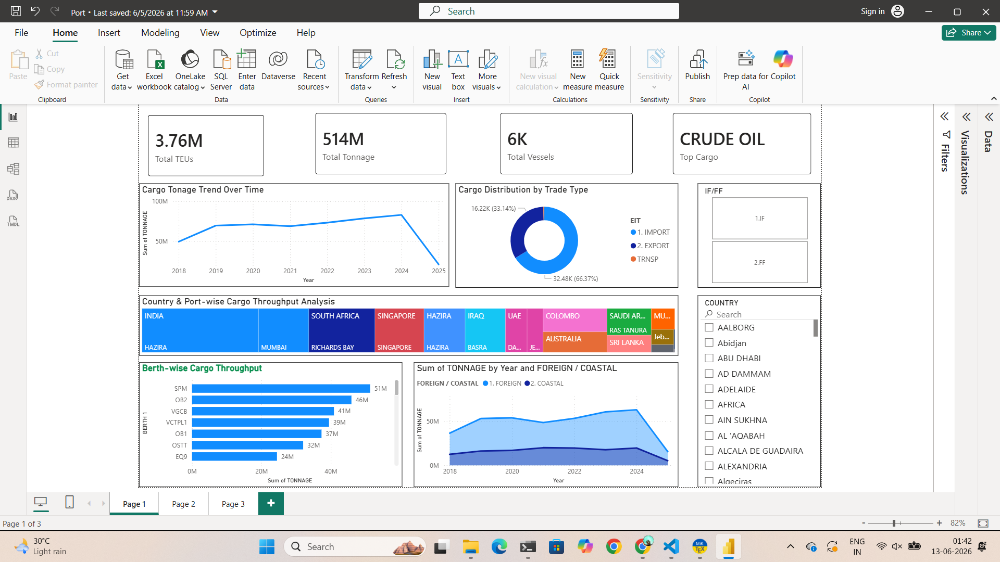
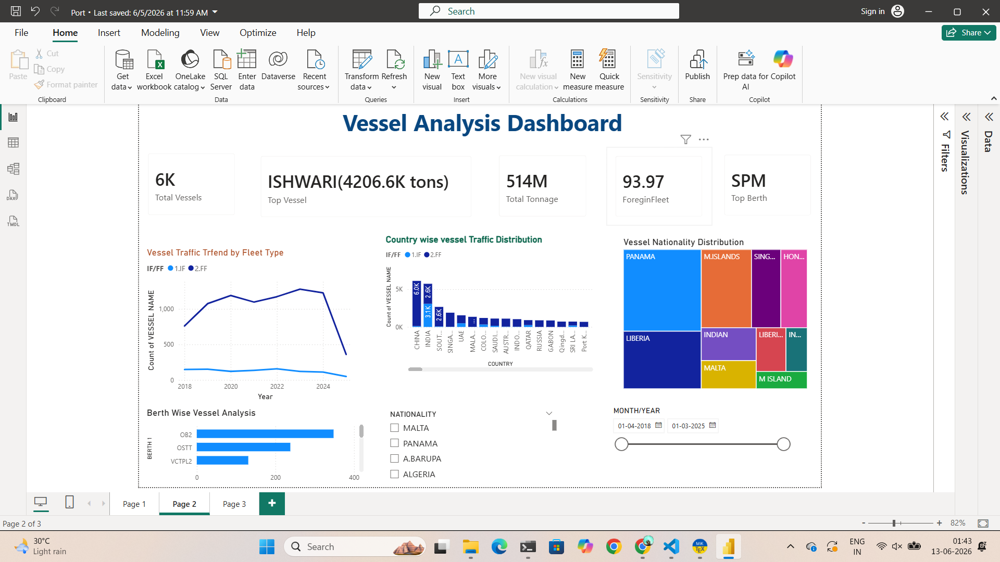
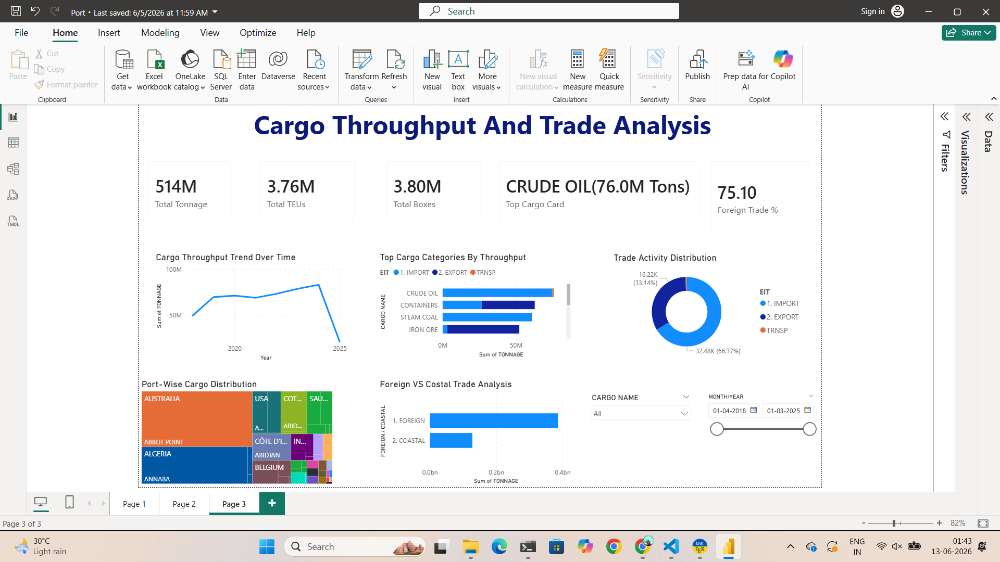

# Port Traffic Analytics Dashboard

## Overview

The Port Traffic Analytics Dashboard is a Business Intelligence solution developed using Power BI to analyze seven years of maritime traffic and trade operations data. The project provides insights into vessel movement, cargo throughput, trade distribution, berth utilization, and international maritime connectivity through interactive dashboards and KPI-driven analytics.

This solution enables stakeholders to monitor operational performance, identify traffic patterns, evaluate trade activity, and support data-driven decision-making in port and logistics operations.

---

## Business Objective

The objective of this project is to transform raw maritime traffic data into meaningful insights that support:

* Cargo throughput monitoring
* Vessel traffic analysis
* Trade activity evaluation
* Berth utilization assessment
* International trade dependency analysis
* Operational performance tracking

---

## Dashboard Structure

### 1. Executive Overview Dashboard

Provides a high-level summary of port operations and overall maritime traffic trends.

#### Key Metrics

* Total Tonnage
* Total TEUs
* Total Vessels
* Top Cargo Category

#### Key Insights

* Overall cargo movement trends
* Trade activity distribution
* Cargo throughput analysis
* Port performance overview

---

### Executive Overview Dashboard



---

### 2. Vessel Analysis Dashboard

Focuses on vessel movement patterns and maritime operations.

#### Key Performance Indicators

* Total Vessels
* Highest Throughput Vessel
* Total Tonnage
* Foreign Fleet Percentage
* Top Berth

#### Visualizations

* Vessel Traffic Trend by Fleet Type
* Country-wise Vessel Traffic Distribution
* Vessel Nationality Distribution
* Berth-wise Vessel Analysis

#### Business Insights

* Foreign fleet dominance in maritime operations
* Major vessel-origin countries
* Vessel traffic growth trends
* Berth utilization patterns
* Operational concentration areas

---

### Vessel Analysis Dashboard



---

### 3. Cargo Throughput & Trade Analysis Dashboard

Analyzes cargo movement, trade activity, and throughput trends.

#### Key Performance Indicators

* Total Tonnage
* Total TEUs
* Total Boxes
* Top Cargo Category
* Foreign Trade Percentage

#### Visualizations

* Cargo Throughput Trend Over Time
* Trade Activity Distribution
* Top Cargo Categories by Throughput
* Foreign vs Coastal Trade Analysis
* Port-wise Cargo Distribution

#### Business Insights

* Cargo categories driving port operations
* Import versus export trends
* Foreign trade contribution
* Regional cargo distribution
* International trade dependency

---

### Cargo Throughput & Trade Analysis Dashboard



---

## Key Findings

### Cargo Operations

* Over **514 million tons** of cargo were handled during the analysis period.
* Crude Oil emerged as the highest-volume cargo category.
* Container traffic accounted for millions of TEUs, indicating significant logistics activity.

### Trade Activity

* Imports contributed the majority share of cargo movement.
* Foreign trade accounted for over **75%** of total cargo throughput.
* Trade activity was concentrated among major international ports and countries.

### Vessel Operations

* Foreign fleet vessels accounted for approximately **94%** of vessel traffic.
* Vessel movement was concentrated among key international trade partners.
* Maritime activity remained relatively stable throughout the analysis period.

### Infrastructure Utilization

* Certain berths handled significantly higher cargo throughput than others.
* Cargo handling operations were concentrated within key operational zones.

---

## Technologies Used

* Power BI
* DAX (Data Analysis Expressions)
* Power Query
* Microsoft Excel

---

## Skills Demonstrated

* Data Cleaning & Transformation
* Data Modeling
* DAX Measure Development
* KPI Design
* Dashboard Development
* Data Visualization
* Business Intelligence Reporting
* Trend Analysis
* Operational Analytics
* Trade Analytics
* Storytelling with Data

---

## Team Members

* Korupolu Siri
* Gutti Bhavana
* Jandyala Amrutha
* Kosuru Jyothsna

---

## Repository Structure

```text
Port-Traffic-Analytics-Dashboard/
│
├── README.md
│
└── screenshots/
    ├── Executive_Dashboard.png
    ├── Vessel_Analysis_Dashboard.png
    └── Cargo_Analysis_Dashboard.png
```

---

## Confidentiality Notice

This project was developed using organizational maritime traffic data provided for educational and analytical purposes. Due to data confidentiality requirements, the underlying dataset, Power BI source files (.pbix), and operational records are not publicly shared.

This repository contains only project documentation, dashboard screenshots, and analytical findings.

---

## Conclusion

The Port Traffic Analytics Dashboard demonstrates how Business Intelligence tools can transform large-scale maritime traffic data into actionable operational and strategic insights. By combining data modeling, DAX calculations, and interactive visualizations, the project provides a comprehensive view of vessel operations, cargo movement, trade activity, and infrastructure utilization across a seven-year period.


